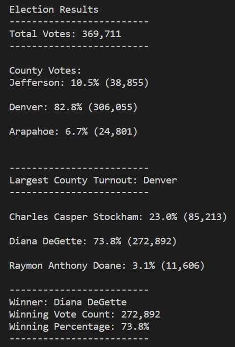

# Election Analysis

## Project Overiew
Tom, as an employee for Colorado Board of Elections, is looking to for a way to automate reporting on election results for the US Congressional Precinct. For this project, we implemented Python, in order to calculate several data values, such as total election votes, total votes by candidate, and the total votes by county. In the reporting analysis, we are also able to make conclusions on the largest city turnout and candidate winner. Python code can be utilized in reporting of elections at different volumes, allowing faster processing and easier comprehension.

## Resources
- Data Source: election_results.csv
- Software: Python 3.8.5, Visual Studioe Code, 1.47.3

# Election Audit Results

1. Total votes in this congressional election
 
    - 369,711 votes were cast in this congresional election

2. A breakdown of the number of votes and the percentage of total votes for each county in the precinct.

    - 306,055 votes were cast in Denver, resulting in 82.8% of total votes
    - 38,855 votes were cast in Jefferson, resulting in 10.5% of total votes
    - 24,801 votes were cast in Arapahoe, resulting in 6.7% of total votes

3. County with the largest number of votes
 
    - The largest number of votes was from Denver country with 306,055 votes. 

4. A breakdown of the number of votes and the percentage of the total votes each candidate received.

    - Diana DeGette received 272,892 votes, resulting in 73.8% of total votes
    - Charles Casper received 85,213 votes, resulting in 23.0% of total votes
    - Raymon Anthony Doane received 11,606 votes, resulting in 3.1% of total votes

5. Winning candidate of the election, their vote count, and  their percentage of the total votes?
    
    - Diana DeGette won the election with a total of 272,892 votes, with 73.8% of total votes

    

# Election Audit Summary

 Python code provides a lot of flexibility when it comes to analyzing the same type of data at different volumes. In order to provide further detail on the election results, we can introduce an array of custom adjustments to the existing process. By introducing additional filters, we can set up the code to showcase leaders by a specified region or their popularity in each county. In comparison with the Excel format, Python code holds the advantage in how easy it can be manipulated to meet a wide range of requests on the same data set.
  